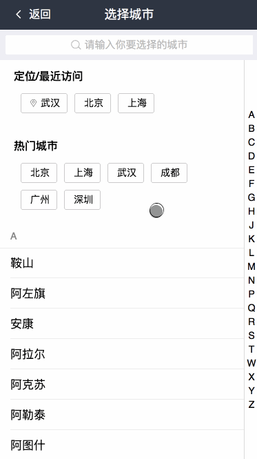
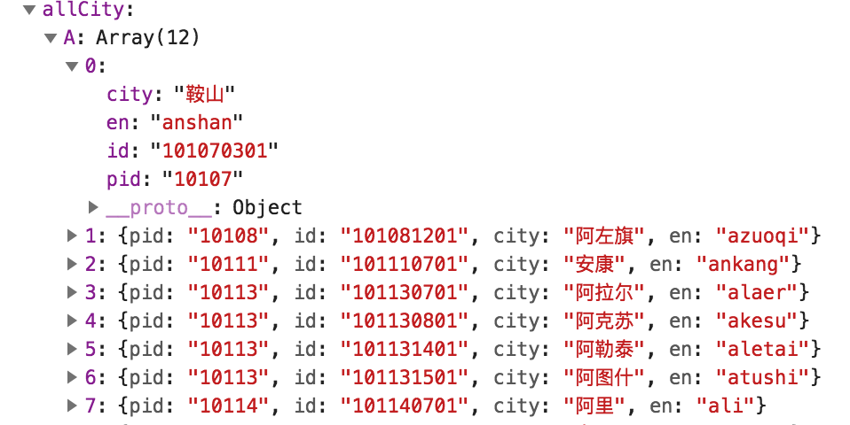
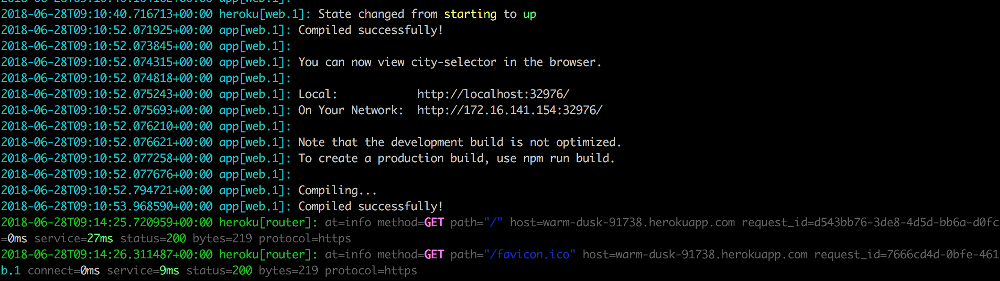

# 城市选择控件

想到做这个，是因为无意中在github上看到了这一个仓库[https://github.com/lunlunshiwo/ChooseCity](https://github.com/lunlunshiwo/ChooseCity)，做的就是一个城市选择控件，是用vue写的，说的是阿里的一道题目，然后想想自己闲着也是闲着，就动手用react又重新做了一遍。

## 演示

地址：[城市选择控件](http://city-selector.rynxiao.cn/)

github: [https://github.com/Rynxiao/city-selector](https://github.com/Rynxiao/city-selector)

整体效果如下：



## 运行

运行需知：首先去百度开放云平台申请自己的AK，申请方法见下面的**定位**

```cmd
# dev
npm install
npm start

# deploy
npm run build
npm install http-server -g
http-server ./build -p 38083 -s -P http://www.msece.com
localhost:38083

# test
npm run test
```

## 要求

- 可定位到当前所在城市，可支持传城市
- 下次打开优先选取上次定位城市，如本次定位和上次不一样，则取本地城市，同时展示最近选择的城市，最近选择的城市可配
- 城市列表按字母分组，如B组：北京、包头，同时左侧带A-Z导航符条，点击对应字母定位至对应的组位置，如点击C则定位至C组，同时弹出提示为C
- 支持城市搜索，页头带搜索框，可支持联想功能，注意性能
- 选择对应城市，会将对应城市数据带回给使用页面
- 支持单个页面上同时存在多个城市组件
- 页面用flex布局（css）

## 说明

个人采用的路由形式，因此没有做成一个具体的组件(要组件化也就是把state换成props传值即可)，但是在整个页面中做了很小单元的拆分。另外“上次定位”的功能暂时未完善，容之后补上。

## 技术栈

采用的是react官网提供的脚手架[create-react-app](https://github.com/facebook/create-react-app)，因此整体技术是`react`，采用`webpack`进行打包构建，`jest`测试。同时在此基础上新增了一些东西。

### sass

脚手架最开始不支持sass，开启sass需要如下配置：

```cmd
# 安装依赖包
npm install --save node-sass-chokidar
npm install --save npm-run-all

# 脚本中增加build-css与watch-css
# 修改start和build命令，让其可以同时运行多个命令
"scripts": {
+    "build-css": "node-sass-chokidar --include-path ./src --include-path ./node_modules src/ -o src/",
+    "watch-css": "npm run build-css && node-sass-chokidar --include-path ./src --include-path ./node_modules src/ -o src/ --watch --recursive",
     "test": "react-scripts test --env=jsdom",
-    "start": "react-scripts start",
-    "build": "react-scripts build",
+    "start-js": "react-scripts start",
+    "start": "npm-run-all -p watch-css start-js",
+    "build-js": "react-scripts build",
+    "build": "npm-run-all build-css build-js"
}

# .gitignore中去除生成的css文件
src/**/*.css
```

### react-router

```cmd
npm install --save react-router-dom
```

安装依赖之后，增加了一个全局入口，在`src/container/index.js`中，如下：

```javascript
<Switch>
    <Route exact path="/" component={ App } />
    <Route path="/city" component={ City } />
</Switch>
```

增加两个页面，路由分别如上配置。

### 定位

需要定位到当前城市，采用的是百度地图的定位，需要首先去百度地图开放平台上申请一个秘钥，地址在这里[http://lbsyun.baidu.com/apiconsole/key](http://lbsyun.baidu.com/apiconsole/key)，进去之后查看js文档，这里不再赘述，可以自己去了解。

- 在`src/public/index.html`中加入百度开放平台提供的脚本链接，填上自己的秘钥。

```html
<script type="text/javascript" src="http://api.map.baidu.com/api?v=2.0&ak=your_ak"></script>
```

- `src/services/locationServices.js`中加入定位代码

```javascript
async function getLocalCity() {
    return new Promise(resolve => {
        var myCity = new window.BMap.LocalCity();
        myCity.get(result => {
            resolve(result.name);
        });
    }); 
}
```

### 获取城市数据

获取城市的接口API，历经千辛万苦终于在网上找到了一个能用的【这个接口有可能随时会挂哟😁😁😁】，但是数据格式可能不太满意，只能自己转化。如果不想用这个格式，你也可以自己起一个后台服务器，然后输出你自己喜欢的格式，这里我算是偷懒了。

之前的格式是按照省份区分的：


格式化之后的格式是按照拼音字母来区分的:



**设置代理**

因为请求的地址域名不一致，肯定会有跨域问题，这里在package.json中设置了代理，如下：

```javascript
"proxy": "http://www.msece.com"
```

**获取城市**

```javascript
// src/services/cityServices.js
async function getAllCities() {
    const json = await axios.get(CITY_API);
    return formatCites(json);
}
```

### UI

UI方面自己没有什么创意，所以使用了阿里的`antd-mobile`，可以去这里看：[antd-mobile](https://mobile.ant.design/docs/react/introduce-cn)

```javascript
// 安装依赖
npm install antd-mobile --save

// 按需加载
// 1. 安装依赖
npm install react-app-rewired --save-dev
npm install babel-plugin-import --save-dev

// 2. 在package.json中，将script中的 react-scripts 换成 react-app-rewired

// 3. 在根目录下建立config-overrides.js，内容如下：
const { injectBabelPlugin } = require('react-app-rewired');

module.exports = function override(config, env) {
    config = injectBabelPlugin(['import', { libraryName: 'antd-mobile', style: 'css' }], config);
    return config;
};

// 4. 更改引入方式
// before
import Button from 'antd-mobile/lib/button';
// after
import { Button } from 'antd-mobile';
```

## coding

进行了组件的拆分，主要为：

- 头部
- 搜索区域
- 需要定位的城市区域（分为最近城市和热门城市）
- 列表区域
- 右侧导航区域
- 搜索弹层区域

具体可以参看`src/components/city`下的组件

### 最近选择城市

采用的是本地localstorage进行存储，默认最多存储两个，后选择的城市会替换掉第一个，如果选择的城市中有相同的，则不进行替换。页面公用本地存储，若不想公用，可以在之后区分id即可。

### 热门城市

热门城市是自己预先定义的，如果不希望预先定义，也可以参照某些API，这里算是偷懒。

### 导航条滑动

之前的写过一篇文章[移动端效果之IndexList](https://www.cnblogs.com/rynxiao/p/7694601.html)，具体实现可以参看。

### 搜索联动

支持中/英文搜索，中文搜索是进行了全数据遍历，英文搜索是进行了首字符判断，然后再进行子集遍历。在搜索方面，使用了函数节流，如果在1秒中之内还没有输入完成，则必须进行一次搜索。

```javascript
// src/utils/index.js
function throttle(fn, wait = 500, period = 1000) {
    let startTime = new Date().getTime();
    let timeout;
    return (...args) => {
        return new Promise(resolve => {
            const now = new Date().getTime();
            if (now - startTime >= period) {
                startTime = now;
                resolve(fn.apply(null, args));
            } else {
                timeout && clearTimeout(timeout);
                timeout = setTimeout(() => {
                    resolve(fn.apply(null, args));
                }, wait);
            }
        }); 
    }
}

// src/pages/city/City.js
const searchCity = throttle(searchCityByName);

onSearchInput = async value => {
    if (!value) {
        this.hideMenuDialog();
        return;
    }

    const { labels, city } = this.state;
    const cities = await searchCity(value, labels, city);
    this.setState({  
        searchArea: true, 
        searchCities: transformCityMenuData(cities) 
    });
}
```

### 部署方面

本来是想使用`heroku`来部署应用的，但是经过一番折腾之后，在heroku的日志中看到服务是已经启动了的，但是外网访问不了，还需要技术支持^_^



后来只能就部署到自己的腾讯云上面去了，案例地址为：[城市选择控件](http://city-selector.rynxiao.cn/)

## 总结

自己看到后就想写来玩玩而已，在其中也进一步了解了测试、react-router 4的用法，以及蚂蚁金服的UI库，也不是说没有收获。在项目中，也经过了一系列的代码重构，比如组件拆分、公共类库提取等等，写案例的同时也是在训练自己的意识，特意分享出来，大家共勉。

最后，代码仓库为：[https://github.com/Rynxiao/city-selector](https://github.com/Rynxiao/city-selector)，如果觉得有点意思，多谢star。


